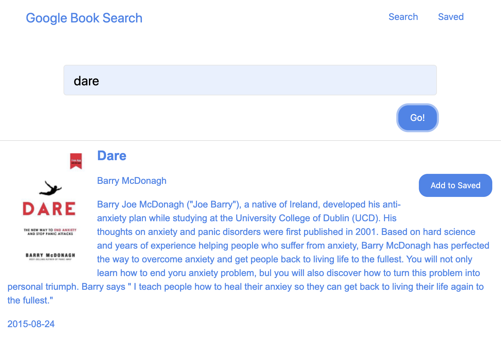

## github.com/dylanhulbert/homework-16
I created the contents of this repo as homework for my Bootcamp at UofO

## Homework 16: Google Book Search
The objective of this homework was to create a React-based Google Books Search app with helper/util functions, and using React lifecycle methods to query and display books based on a users search.  It also used Node, Express and MongoDB so that users can save books.

## Technologies
* [React](https://reactjs.org/)
* [Node.js](https://nodejs.org/en/)
* [Express](https://expressjs.com/)
* [Mongoose](https://mongoosejs.com/) for [MongoDB](https://www.mongodb.com/)

## Application
You can view the functioning application [running on Heroku](https://hulbert-homework-16.herokuapp.com/).

